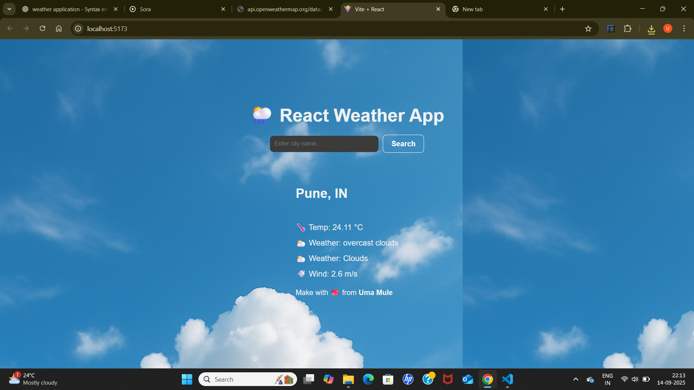

# 🌦️ React Weather App

A simple weather application built with **React** and the **OpenWeatherMap API**.  
Users can search for any city and view real-time weather information such as **temperature, weather condition, and wind speed**.  

---

## 📸 Screenshot



*(Replace `screenshot.png` with the actual file name of your app screenshot. Put it in your project root.)*

---

## 🚀 Features
- 🌍 Search weather by city name  
- 🌡️ Display temperature in Celsius  
- ☁️ Show weather description (clear, cloudy, rainy, etc.)  
- 💨 Show wind speed  
- 🎨 Dark theme with a beautiful background image  
- 📱 Responsive & mobile-friendly design  

---

## 🛠️ Tech Stack
- **React (Vite)** ⚛️  
- **JavaScript (ES6+)**  
- **CSS (Flexbox & custom styling)**  
- **OpenWeatherMap API** 🌐  

---

## 📂 Project Structure
weather-app/
┣ public/
┃ ┗ weather-bg.jpg
┣ src/
┃ ┣ components/
┃ ┃ ┣ SearchBox.jsx
┃ ┃ ┗ WeatherCard.jsx
┃ ┣ App.jsx
┃ ┣ App.css
┃ ┗ main.jsx
┣ package.json
┣ README.md
┗ screenshot.png

---

## 🔑 Setup & Installation

1. Clone the repository:
   ```bash
   git clone https://github.com/your-username/weather-app.git
   cd weather-app

---

👉 You just need to:
1. Take a screenshot of your app (like the one you showed me).  
2. Save it as **`screenshot.png`** in your project root.  
3. Commit & push to GitHub.  

## concept
Concept of the Application

The React Weather App is designed to provide users with a simple and interactive way to check real-time weather conditions for any city in the world.

🌍 Global Coverage: Users can search by entering the city name and instantly get live weather updates using the OpenWeatherMap API.

🌡️ Instant Weather Info: Displays temperature (in °C), weather conditions (mist, clear, cloudy, rainy, etc.), and wind speed.

🎨 User-Friendly UI: The app is built with a clean, responsive design, centered layout, and background image for a modern look.

⚡ Learning Project: This project demonstrates React basics (components, props, state, hooks) along with API integration, making it a great beginner-friendly project to understand how frontend connects with external services.

In short, this application helps users quickly know the weather of their city (or any other city worldwide) while also showcasing practical usage of React with APIs.


## deployment

[https://weather-application-ohw3.vercel.app/
](url)
 Made with ❤️ from Uma
